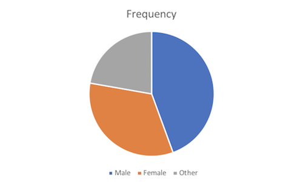
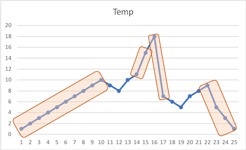
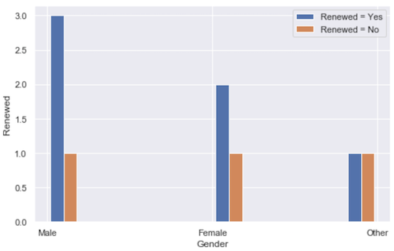
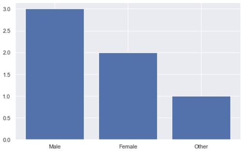

# Quick Start

## Installation

You can install using the pip package manager by running:

```
$ pip install data-insights

```

Alternatively, you could install directly from Github:

```
$ pip install https://github.com/SimitTomar/Car_Insurance_Model-master.zip

```

<!-- toc -->
* [Usage](#usage)
* [Methods](#methods)
* [NLP](#nlp)

<!-- tocstop -->

## Usage

<!-- usage -->

The Data Insights generates intuitive graphs and useful information that help you understand your Data Features better. Simply, import the library and call the relvant method like below:


```
from data_insights import DataInsights

df = pd.DataFrame(
    [['Male','Yes'],
     ['Male','Yes'],
     ['Female', 'Yes'],
     ['Female', 'Yes'],
     ['Other', 'Yes'],
     ['Female', 'No'],
     ['Other','No'],
     ['Male', 'Yes'],
     ['Male', 'No']],
    columns=['Gender', 'Renewed']
)

# Create the Data Insights instance
di = DataInsights(data = df)


di.two_features_all_insights(first_feature='Gender', second_feature='Renewed')

```

<!-- usagestop -->
# Methods
<!-- methods -->

The Library provides insight methods for the below 3 levels
* [`single feature`](#single_feature)
* [`two features`](#two_features)
* [`multiple features`](#multiple_features)


## `single feature`

This section provides details of all the methods that can give insights on a single feature (column)

### Insights on Categorical Data

* single_feature_data_insights

This method gives all the data insights of a single feature

```

di.single_feature_data_insights(first_feature='Gender')

```

Output:

```

Generic Information:
Total Records: 9
Unique Values: 3
Missing Values: None

Patterns:
4 Males (44%) available
3 Females (33%) available
2 Others (23%) available

```

* single_feature_visual_insights

This method gives all the visual insights of a single feature

```

di.single_feature_data_insights(first_feature='Gender')

```

Output:



### Insights on Continous Data

* single_feature_data_insights

Say, the Temperature of a city is noted for 25 days:

Temp = [1,2,3,4,5,6,7,8,9,10,9,8,10,11,15,18,7,6,5,7,8,9,5,3,1]

Output:

```

Generic Information:
Total Records: 25
Unique Values: 3
Missing Values: None

Patterns:
Temperature has risen consecutively for days 1 to 10
Temperature has risen consecutively for days 22 to 25
The maximum rise in temperature between 2 consecutive days was from 11 to 15 (4 Points) for Days 14th & 15th
The maximum decline in temperature between 2 consecutive days was from 18 to 7 (11 Points) for Days 16th & 17th

Statistical Information:

Minimum Temp: 1
Maximum Temp: 18
Mean Temp: 7.08
Median Temp: 7
Variance: 15.43
Standard Deviation: 3.92

```

* single_feature_visual_insights

The below graph outlines the Temp Patterns:




* single_feature_all_insights

This method is simply a combination of Data and Visual insights

## `two features`
This section provides details of all the methods that can give insights on two features (columns)

* two_features_data_insights

This method gives all the data insights of one feature w.r.t another feature

```

di.two_features_data_insights(first_feature='Gender', second_feature='Renewed')

```
Output:

```

Generic Information:
Total Records: 9
Unique Values: 3
Missing Values: None

Patterns:
3 Male (75%) available for Renewed = Yes
1 Male (25%) available for Renewed = No
2 Female (67%) available for Renewed = Yes
1 Female (33%) available for Renewed = No
1 Other (50%) available for Renewed = Yes
1 Other (50%) available for Renewed = No

```

* two_features_visual_insights

This method provides all the visual insights of one feature w.r.t another feature

```

di.two_features_visual_insights(first_feature='Gender', second_feature='Renewed')

```

Output:





* two_features_all_insights

This method is simply a combination of Data and Visual insights


## `multiple features`
This section provides details of all the methods that can give insights on multiple features w.r.t multiple features (columns)

Section needs to be updated

<!-- methodsstop -->


# NLP
<!-- nlp -->

This capability will allow users to fetch information through Natural Language.

Query:

```
di.nlp('How many males got their insurance renewed ?')

```

Outcome:

```

3 Males got their Policies Renewed

```

Query:

```
di.nlp('Which category has the least Reneweal ratio ?')

```

Outcome:

```

Other Category has the least Renewal ratio

```

<!-- nlpstop -->